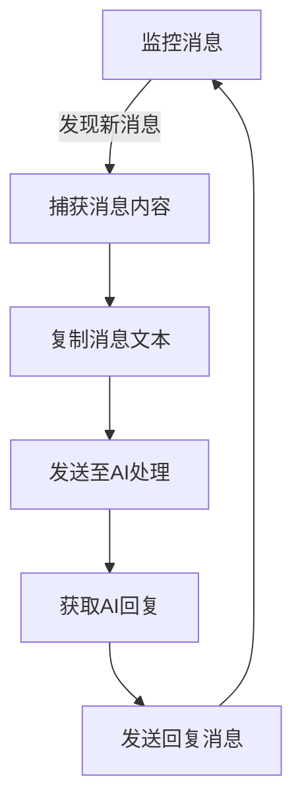

# AutoConvoBridge
AutoConvoBridge（前名：AI Auto Replier），屏幕自动化把两个聊天会话窗口连通的项目。
[toc]

## 初衷与项目信息
这本是一个微信自动回复机器人的解决方案，在屏幕的一部分挂微信，另一侧挂着AI的窗口，设定好窗口位置，该程序会检测有新消息发来，模拟鼠标点击将消息复制然后粘贴到AI窗口并粘贴，再将AI的结果发回微信。也就是说，它能够将微信的聊天与 AI 的聊天会话连通。

经过发展，这个项目的用法越来越广。它已经不仅仅能作为微信 - AI 会话的桥梁，更可以将其他类型的会话，如微信 - 微信、AI - AI连通起来。

这个项目还没有封装为可执行程序，因此您必须按照[安装与开始](#安装与开始)的指南进行部署。

### 主要特性
- 将消息自动转发给 AI 并返回回复（可用于微信等聊天程序）
- 支持中文消息处理与剪贴板（clipboard）集成
- 简单的配置文件（settings.json）控制行为
- 日志记录与故障回滚机制
- 可扩展：以模块化方式或代码配置方式添加新的 AI/处理后端或消息来源

### 使用场景
- 个人助理：自动回复日常消息
- 客服机器人：处理常见咨询
- 信息分类：智能处理和转发消息
- 自动化回复：设定规则自动处理特定类型消息

### 目录概览
- `main.py` — 程序入口，负责启动与主循环。
- `chat_session.py` — 与 AI 的会话管理、请求/响应处理、重试逻辑。
- `chat_window.py` — GUI/界面相关（如果启用）。
- `logs.py` — 日志文件与日志格式封装。
- `settings.json` — 主配置文件（请根据示例修改）。
- `requirements.txt` — Python 依赖。
- `model/`、`feature/` — 扩展或模型文件目录（可选）。
- `logs.txt` — 运行日志示例/历史（可忽略或清理）。

## 安装与开始
### 检查系统需求
首先，确保您的设备满足以下任意系统要求：
- Windows 7 及以上版本的系统，x86_64 或 ARM 架构

### 下载本项目
您可以通过下载源码包或克隆仓库的方式来下载本项目。

#### 下载源码包
> [!Tip]
> 如果您对这个领域不熟悉的普通用户，或不知道我在说什么，那么请看这里，我们建议您下载源码包。

- 点击本网页（github.com/XingYuan55/autoreplier）中上部的绿色 `Code`（代码）按钮，然后点击浮窗最底端的`Download Zip`（下载 Zip）
- 如果您找不到上述按钮，也可以[点击这里直接下载](https://github.com/XingYuan55/autoreplier/archive/refs/heads/master.zip)

下载后，请解压这个压缩包。

#### 克隆仓库
```bash
git clone https://github.com/XingYuan55/autoreplier.git
```
### 部署本项目
1. 下载项目后，进入目录：
   ```bash
   cd autoreplier
   ```

2. 如果您的电脑中安装有python3，请安装依赖：
   ```bash
   python -m pip install -r requirements.txt
   ```
   当然，您也可以先创建虚拟环境。

   > [!NOTE]
   > 为方便使用，本项目自带有python虚拟环境，位于[.venv/](/.venv/)目录下，并且已经安装好了依赖库。如果您是对这个领域不熟悉的普通用户，请按照下面的指南激活python虚拟环境：
   > ```bash
   > .venv\Scripts\activate
   > 
   > python -m pip install -r requirements.txt
   > ```

3. 编辑 `settings.json`（见下一节），然后运行：
   ```bash
   python main.py
   ```

## 基本配置与使用
[main.py](/main.py) 是本项目的一般程序入口。

[settings.json](/settings.json) 是[main.py](/main.py)的配置文件。

### 配置文件
我们假设您将本项目用于连通微信和AI聊天窗口。

以下是配置文件 [settings.json](/settings.json) 的示例及字段说明：
```json
{
// 微信部分的设置
  "wx_send_coordinate": [680, 823],  // 输入消息处坐标
  "wx_reply_coordinate": [736, 731],  // 他人发来信息的坐标 
  "wx_reply_window": [  // 监视窗口变化范围
    [666, 500],  // 左上角
    [850, 753]  // 右下角
  ],

// AI会话部分的设置
  "ai_send_coordinate": [100, 929],  // 输入消息处坐标
  "ai_reply_coordinate": [114, 848],  // AI 回复信息的坐标 
  "ai_reply_window": [  // 监视窗口变化范围
    [58, 461],  // 左上角
    [282, 808]  // 右下角
  ]
}
```
字段详细解释：
- wx_send_coordinate: [x, y]  
  微信输入框中的坐标（点击后能粘贴/输入消息）。
- wx_reply_coordinate: [x, y]  
  用于“对话有新消息时”模拟点击的参考坐标，通常是发来的最新消息显示的坐标。
- wx_reply_window: [[x1, y1], [x2, y2]]  
  监听微信消息变化的矩形区域（左上角与右下角）。该程序会在这个区域内检测像素变化判断是否有新消息。
- ai_send_coordinate / ai_reply_coordinate / ai_reply_window:  
  同上，但作用于目标会话窗口（AI 窗口或另一端聊天程序）。


## 程序运行逻辑

### 1. 基本工作流程



### 2. 自动化控制实现

#### 消息捕获机制
- 通过预设的快捷键触发消息捕获
- 使用 Win32 API 监控剪贴板变化
- 自动识别消息窗口位置

#### 鼠标控制流程

- 使用 PyAutoGUI 库实现鼠标自动化控制
- 预设关键位置坐标（消息框、发送按钮等）
- 执行精确的点击和拖拽操作

### 日常使用建议

- 定期检查坐标准确性
- 保持窗口布局稳定


