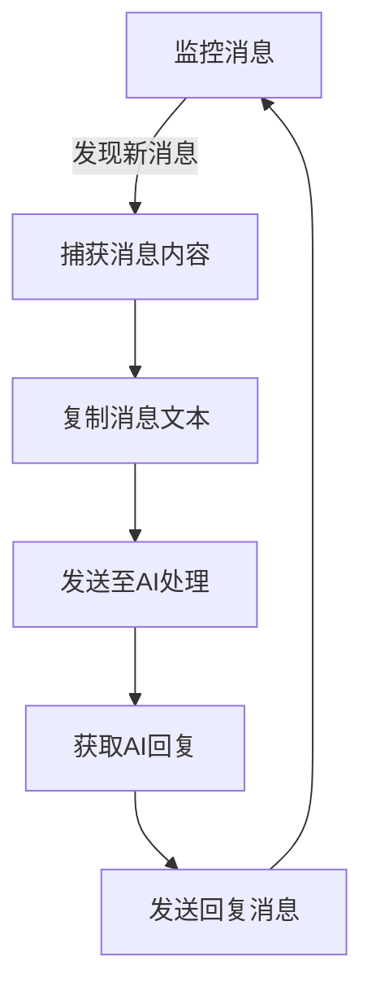

# AI Auto Replier

一个自动监控微信消息并通过 AI 回复的程序。
更详细地说：AutoReplier 是一个基于 Python 开发的智能自动化工具，专门用于监控和处理微信（或其他程序）的消息，并通过 AI 实现智能回复功能。

## 项目介绍 | Project Introduction

### 主要特点 | Key Features

1. **智能消息监控 | Intelligent Message Monitoring**
   - 实时监控微信消息
   - 支持多种消息类型处理
   - 智能识别会话上下文

2. **AI 驱动对话 | AI-Powered Conversations**
   - 自动将消息转发给 AI 处理
   - 智能生成符合上下文的回复
   - 保持对话的连贯性和自然度

3. **中文优化 | Chinese Language Support**
   - 完整的中文支持
   - 针对中文对话场景优化
   - 适配中文输入输出

4. **剪贴板管理 | Clipboard Management**
   - 智能剪贴板操作
   - 自动文本复制粘贴
   - 多格式内容支持

5. **可靠性保障 | Reliability Features**
   - 故障安全机制
   - 异常自动恢复
   - 运行状态监控

### 使用场景 | Use Cases

- 个人助理：自动回复日常消息
- 客服机器人：处理常见咨询
- 信息分类：智能处理和转发消息
- 自动化回复：设定规则自动处理特定类型消息

### 优势特色 | Advantages

1. 🚀 快速部署：简单配置即可使用
2. 💡 智能对话：基于AI的自然语言处理
3. 🛡️ 稳定可靠：内置故障保护机制
4. 🔄 灵活扩展：支持自定义规则和处理流程

### 适用人群 | Target Users

- 需要自动化处理消息的个人用户
- 寻求智能客服解决方案的小型企业
- 想要提高消息处理效率的团队
- 对 AI 对话感兴趣的开发者

这个项目致力于简化消息处理流程，通过 AI 技术提供智能、自然的自动回复功能，帮助用户提高工作效率，减少重复性工作。

## 程序运行逻辑 | Program Logic

### 1. 基本工作流程 | Basic Workflow



### 2. 自动化控制实现 | Automation Control Implementation

#### 消息捕获机制 | Message Capture

   - 通过预设的快捷键触发消息捕获
   - 使用 Win32 API 监控剪贴板变化
   - 自动识别消息窗口位置

#### 鼠标控制流程 | Mouse Control Flow
   - 使用 PyAutoGUI 库实现鼠标自动化控制
   - 预设关键位置坐标（消息框、发送按钮等）
   - 执行精确的点击和拖拽操作

### 日常使用建议 | Daily Usage Tips

   - 定期检查坐标准确性
   - 保持窗口布局稳定

## 使用要求

- Python 3.x
- 依赖库：
  - pyautogui
  - pygetwindow
  - pillow
  - pywin32

## 安装依赖

```bash
pip install pyautogui pygetwindow pillow pywin32
```

## 使用说明

1. 确保微信窗口在正确位置
2. 配置 settings.json：
   - 设置窗口坐标
   - 配置模型参数
   - 自定义对话风格
3. 运行程序：
   - 在线模式：python main.py
   - 离线模式：python main_offline_model.py
4. 程序会自动处理新的微信消息
5. 移动鼠标到屏幕角落或按 Ctrl+C 可停止程序


## 更新日志

### 25021203-refactor+docs @ ver2.0.1-beta2: 封装控制鼠标和消息交互的代码，并在main.py中使用
```bash
commit (origin/feature/chat-window-interface)
Author: Xingyuan55 <dus0963@outlook.com>
Date:   Tue Feb 12 23:21 2025 +0800

   25021203-refactor @ ver2.0.1-beta3: 完善文档；封装控制鼠标和消息交互的代码，并在main.py中使用:
   将聊天窗口的基础底层封装到chat_window.py的ChatWindow类，将消息交互的完整流程封装到更高级的接口chat_session.py的ChatSession类。目前只重构好了main.py中的
   添加了README文档的项目介绍部分
```

### 25021104-refactor+docs @ ver2.0:  添加本地部署模型（离线模式）
```bash
commit (HEAD -> master, origin/master, origin/feature/offline-model, feature/offline-model)
Author: Xingyuan55 <dus0963@outlook.com>
Date:   Tue Feb 11 23:46 2025 +0800

   25021103-refactor @ ver2.0: 添加本地部署模型（离线模式）:
   此次提交是 49b2126b 的文档更新提交，作为ver2.0的发布
   更新：
   1. 添加本地化模型部署(main_offline_model.py)，此离线模式下无需依赖浏览器AI对话
```

### 24121411 @ ver 1.1

```bash
commit (HEAD -> master)
Author: XingYuan55 <dus0963@outlook.com>
Date:   Sun Dec 14 9:26 2024 +0800

    24041211 @ ver 1.1:
    更新：
    1: 增加日志系统
    2: 将配置信息移至外部JSON文件
```

### 24120802 @ ver1.0-rc2

```bash
commit (HEAD -> master)
Author: XingYuan55 <dus0963@outlook.com>
Date:   Sun Dec 8 23:07 2024 +0800

    24120802 @ ver1.0-rc2: 修复了有时发生的以下两个问题，提升程序稳定性：
    1: 光标只会移动到相应位置，在尝试复制无果后，剪贴板里不是空的，而是刚刚ai给我发的消息，然后会将AI发来的信息发回去。
    2: 复制微信的中文来信后程序不将光标挪到AI输入框而是提示未检测到文字，剪贴板为空[]。经检验，程序确实选中了中文来信，但是就是没发给AI。
```

修复了以下问题：

1. 中文文本处理问题

   - 修复了连续发送中文和表情后无法正确复制中文文本的问题
   - 改进了剪贴板内容的编码处理

2. 剪贴板管理

   - 添加了剪贴板清空功能
   - 确保每次复制操作前清空剪贴板
   - 防止使用旧的剪贴板内容

3. 状态控制优化

   - 改进了消息处理状态的管理
   - 修复了状态重置的时机
   - 避免重复处理和错误的消息转发

4. 稳定性提升
   - 增加了关键操作的等待时间
   - 改进了异常处理机制
   - 提高了程序的整体稳定性

### 24030801 @ ver1.0-rc1

```bash
commit (HEAD -> master)
Author: XingYuan55 <dus0963@outlook.com>
Date:   Sun Dec 8 21:52 2024 +0800

    24120801 @ ver1-rc: 已基本稳定实现功能
```

## 注意事项

1. 程序运行时请勿移动窗口位置
2. 确保微信和 AI 窗口都保持在前台可见
3. 不要手动干预自动操作过程
4. 程序会自动跳过表情和图片消息

## 已知问题

1. 需要预先设置好窗口位置，依赖窗口位置的固定坐标。这将在后续版本中变为外部 json 配置文件的设置项
2. 对图片和文件消息不支持处理

## 贡献

欢迎提交问题报告和改进建议。

## 许可证

MPL 2.0 License

## 配置说明

settings.json 支持以下配置：

1. 窗口坐标：

   在线模式： 

   - ai_reply_coordinate: AI 回复区域坐标 

   - ai_send_coordinate: AI 发送框坐标

   - ai_reply_window: AI 窗口监控区域

   通用： 

   - wx_send_coordinate: 微信发送框坐标 

   - wx_reply_coordinate: 微信消息区域坐标 

   - wx_reply_window: 微信监控区域范围

2. 离线模型配置：

   - model.ai_system_prompt: 系统提示词

   - model.message_memory_rounds: 记忆轮数
   
   - model.message_examples: 示例对话（可选）